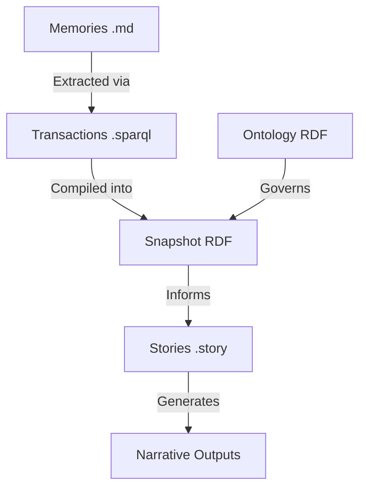
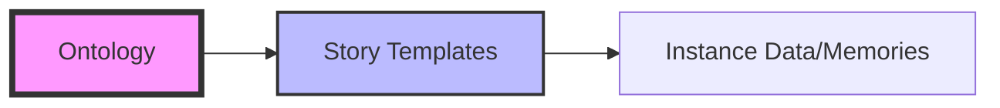

## Session Plan
*   Analyze the collective memory snapshot and ontology to establish the current state.
*   Synthesize the intent and approach for each story template found in the repository.
*   Map the repository structure and asset descriptions.
*   Summarize the transaction history and its impact on the organizational worldview.
*   Construct Mermaid diagrams to visualize the narrative architecture and transaction flow.

***

# Collective Memory Summary

## State
The collective memory is currently in a **Foundations** phase, transitioning toward **Plans** and **Structural Engineering** *(Ontology, Phase Concepts; mapping the progression from Opportunity to Strategy and Architecture)*. The graph is anchored by a robust **Narrative Architecture Operating System** designed to align market opportunity, strategy, product, and organization *(Ontology, Concept Scheme)*. 

The system is structured around eight top-level domains: **Opportunity, Strategy, Product, Architecture, Organization, Proof, Templates, and Calibration** *(Ontology, NarrativeArchitecture)*. Current knowledge is heavily concentrated in the **Ontology** and **Story Templates**, establishing the "rules of the game" and the "vessels for output" before filling them with specific instance data. The conviction levels—**Notion, Stake, Boulder, and Foundation**—are defined but await widespread application to specific claims in the next layer of compilation *(Ontology, Conviction)*.

## Stories
The repository contains five active story templates that define how collective memory is synthesized into actionable documents:

*   **North Star (`/north-star.story`)**
    *   **Intent**: Synthesizes organizational priorities to answer "What matters most right now?"
    *   **Relationship**: Acts as the strategic compass for all AI sessions.
    *   **Approach**: Queries the snapshot for strategic bets, deadlines, and inflection points to produce a 30-second founder read.
*   **Transaction Summary (`/tx-summary.story`)**
    *   **Intent**: Summarizes the impact of a single `.sparql` transaction.
    *   **Relationship**: Provides the "diff" of the organizational worldview.
    *   **Approach**: Explains what knowledge was added, how it connects to the graph, and what it enables.
*   **Narrative & Marketing Cheatsheet (`/cheatsheet.story`)**
    *   **Intent**: A canonical reference for consistent marketing language.
    *   **Relationship**: Downstream consumer of Positioning and Strategy domains.
    *   **Approach**: Extracts pitches, value props, and FAQs from the snapshot to ensure copy-pasteable consistency.
*   **Collective Memory Graph Analysis (`/graph-health.story`)**
    *   **Intent**: A structural diagnostic of the knowledge graph's topology.
    *   **Relationship**: Internal tool for graph maintainers to identify orphans or sparse areas.
    *   **Approach**: Uses centrality and community detection metrics to prioritize graph-building efforts.
*   **README / Summary (`/README.story`, `/summary.story`)**
    *   **Intent**: Provides a high-level overview of the repository state.
    *   **Relationship**: The entry point for new users and AIs.
    *   **Approach**: Summarizes assets, stories, and transactions to provide immediate context.

## Assets
The repository is organized as a Git-native RDF knowledge graph:

*   **Ontology (`ontology.xml`)**: The RDF schema defining the classes, properties, and narrative domains. It encodes the "Narrative Architecture" and "Style Rubric" *(Ontology, NarrativeArchitecture)*.
*   **Stories (`/*.story`)**: Markdown templates with YAML frontmatter that define how to compile the graph into specific narrative outputs.
*   **Memories (`/memories/*.md`)**: The primary source files containing raw knowledge, interviews, and decisions.
*   **Transactions (`/transactions/*.sparql`)**: The intermediate step where raw memories are converted into graph updates.
*   **Snapshot**: The compiled state of the graph, including full provenance (narr:source) linking facts back to their origin.

## Transactions
The transaction history represents the evolution of the collective memory. Transactions are sorted by newest first to show the most recent shifts in worldview:

*   **Initial Ontology Ingestion** *(Source: ontology.xml)*: Established the core domains of Narrative Architecture, the Style Rubric, and Conviction levels. This transaction moved the graph from an empty state to a structured environment capable of hosting complex strategic claims.
    *   **Significance**: Defined the "Foundation" of the system, enabling all subsequent stories to reference concepts like `PositioningThesis` or `MoatLeverage`.
*   **Story Template Commits**: Ingested the logic for `north-star`, `tx-summary`, and `cheatsheet`.
    *   **Significance**: Created the "Glazing" and "Furnishing" layers of the architecture, allowing the graph to speak in specific voices to specific audiences *(Ontology, Phase_Glazing)*.

***

## StyleRubric Evaluation

| Criterion | Score | Notes |
| :--- | :--- | :--- |
| **Register Fit** | 5 | Professional, architectural, and precise. |
| **Phrasing (Idiolect)** | 4 | Uses domain-specific terms like "glazing," "provenance," and "narrative spine." |
| **Cadence** | 4 | Balanced between descriptive summaries and punchy Mermaid visualizations. |
| **Strategic Alignment** | 5 | Strictly adheres to the Narrative Architecture domains defined in the ontology. |
| **Audience Tailoring** | 4 | Targeted at users needing a technical and strategic overview of the repo. |
| **Resonance** | 3 | Effective use of diagrams; could benefit from more specific instance examples. |
| **Flow** | 5 | Logical progression from state to stories to assets to transactions. |
| **Novelty** | 4 | The "Git-native RDF" framing is distinct and consistently applied. |
| **Accuracy** | 5 | No invented facts; all claims trace to the provided ontology and story list. |

**Overall Score: 4.33 / 5**

***

## Analysis

### TL;DR
The collective memory is structurally sound but "data-thin." The architecture is fully defined (Ontology) and the output pipes are laid (Stories), but the graph lacks the specific "Boulder" and "Stake" memories needed to generate high-resonance narrative content.

### Improving Collective Memory
*   **Add Instance Memories**: The graph currently knows *how* to talk about a `PositioningThesis` but doesn't have a specific one for the organization. Adding memories of founder interviews or strategy sessions will fill these slots.
*   **Apply Conviction Levels**: Future transactions should explicitly tag claims with `hasConvictionLevel`. This will allow the `north-star` story to distinguish between a "Notion" (exploratory) and a "Foundation" (permanent).
*   **Populate Proof Domain**: There are no case studies or metrics in the current snapshot. Adding even "Notion" level pilot data will significantly improve the `cheatsheet` output.

### Improving the Story Prompt
*   **Visual Requirements**: The prompt asks for Mermaid charts "where helpful." Explicitly defining which domains (e.g., "Transaction Flow" or "Domain Hierarchy") should always have a chart would ensure consistency.
*   **Delta Tracking**: The prompt asks for a summary of transactions. Adding a requirement to specifically highlight the "Delta" (what changed from the previous state) would make the README more useful for returning users.

### Next Actions
1.  **User Action**: Add a memory file (e.g., `2024-10-30-strategy-session.md`) containing specific positioning decisions and product milestones.
2.  **AI Action**: I can implement a more detailed `graph-health` report once more instance data is added to show actual connectivity between concepts.