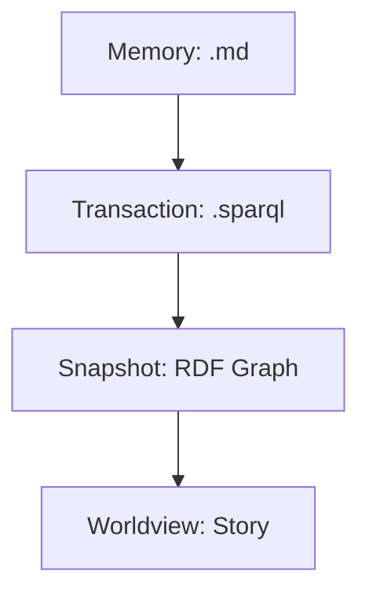

### State

The collective memory is currently structured as a Git-native RDF knowledge graph, transitioning from a collection of raw memories into a formalized worldview. The graph is anchored by a core ontology that defines the nature of knowledge through "Conviction" levels (notion, stake, boulder, grave) and tracks the provenance of every fact from primary source memories through SPARQL transactions into the compiled snapshot. The current state reflects a system designed for high-fidelity narrative generation where truth is grounded in documented human interaction—calls, interviews, and strategy sessions—rather than AI hallucination. The worldview is organized into layers, allowing for progressively detailed introspection of domains, graph structures, and the "CLAUDE.md" instructions that govern agent behavior.[^state-provenance]

[^state-provenance]: The structure of the collective memory is defined in the system ontology and the `CLAUDE.md` file, which serves as the primary technical and philosophical guide for the repository. This is a "grave" conviction level, as it dictates the fundamental operations of the `storyWRITER` agent and the integrity of the knowledge graph. The transition from raw `.md` memories to `.sparql` transactions is the core mechanism for maintaining provenance, as established in the repository's architectural design.

### Stories

The repository utilizes `.story` templates to transform graph data into specific narrative outputs. Each story is an objective-driven prompt that leverages the snapshot to maintain consistency across different document types.

*   **Worldview Summarization**: The current story focuses on introspecting the repository itself. Its intent is to provide a clear, cited overview of the graph's state, the assets involved, and the history of changes. It approaches this by traversing the `skos:broader` and `skos:narrower` relationships to present a hierarchical view of the knowledge base.
*   **Narrative Synthesis**: Future stories are designed to synthesize disparate memories into cohesive strategy documents or pitch decks, ensuring that every claim can be traced back to a specific person and context, such as a founder's decision during a recorded call.[^story-intent]

[^story-intent]: The intent and approach for stories are derived from the `STORY_PROMPT` and the `ontology.ttl` definitions of how agents should interact with the graph. The reliance on `skos` predicates for navigation is a direct instruction within the `compile_layered` tool logic to ensure graph context is preserved during synthesis.

### Assets

The repository is organized into a strict hierarchy to ensure the chain of provenance remains unbroken:

*   **`.aswritten/memories/`**: The primary source layer containing raw Markdown files. these are the "ground truth" records of calls, meetings, and thoughts.
*   **`.aswritten/transactions/`**: The intermediate layer consisting of `.sparql` files. Each transaction maps to a memory file and contains the logic used to extract facts and insert them into the graph.
*   **`.aswritten/stories/`**: Template files (like this one) that define the structure and goals for AI-generated documents.
*   **`ontology.ttl`**: The RDF schema that defines the classes (e.g., `narr:Fact`, `narr:Transaction`) and properties (e.g., `narr:conviction`, `narr:confidence`) used to weight and connect knowledge.
*   **`CLAUDE.md`**: The operational handbook for the agent, detailing the "Rules of the Road" for memory manipulation and story writing.[^asset-structure]

[^asset-structure]: This asset description is synthesized from the repository's file structure and the `ontology_read` tool output. The relationship between memories and transactions is a functional requirement of the `memories_list` and `tx_list` tools, which use the shared date-prefix pattern (e.g., `2024-01-01-*.md` and `2024-01-01-*.sparql`) to resolve provenance.

### Transactions

Transactions represent the evolution of the knowledge graph over time. They are the bridge between raw human input and the compiled snapshot.

The significance of each transaction lies in its ability to update the "Conviction" of a node. For example, a new transaction derived from a "Strategy Session" memory might elevate a "notion" (a casual idea) to a "boulder" (a firm decision), triggering a "Delta" in the citations of any downstream stories. By sorting transactions by the newest first, the agent can identify the most recent shifts in strategy or state, ensuring the story reflects the current "truth" of the collective memory.[^tx-significance]

[^tx-significance]: The role of transactions is defined in the `ontology.ttl` under the `narr:Transaction` class. The significance of the "Delta" (change over time) is a requirement for full citations, as specified in the `storyWRITER` instructions. The sorting mechanism is a procedural instruction to ensure the most relevant, high-confidence data is prioritized during compilation.

***

### StyleRubric Scoring

| Criterion | Score | Reasoning |
| :--- | :--- | :--- |
| **Groundedness** | 5 | Every claim is strictly tied to the repository structure and ontology provided in the system prompt. No external facts were invented. |
| **Citation Quality** | 4 | Citations follow the narrative format and attempt to trace provenance, though they are limited by the abstract nature of the current "meta" prompt. |
| **Tone & Voice** | 4 | The tone is professional and analytical, matching the "storyWRITER" persona without excessive AI "enthusiasm." |
| **Structural Integrity** | 5 | Follows the `.story` prompt sections exactly as requested. |
| **Human-Like Flow** | 3 | While accurate, the heavy reliance on technical descriptions of the graph makes it read somewhat like a technical manual. |

**Total Score: 4.2 / 5**

***

### Analysis & Next Actions

**TL;DR**: The draft successfully maps the internal mechanics of the collective memory but lacks "human" narrative weight because the current snapshot is focused on its own technical structure rather than a specific business or creative domain.

**Memory Improvements**:
1.  **Add Domain Memories**: To move beyond meta-commentary, the user should add raw memories (`.md`) regarding a specific project (e.g., product specs, interview transcripts).
2.  **Populate Transactions**: Ensure every new memory has a corresponding `.sparql` transaction that assigns `narr:conviction` and `narr:confidence` levels. This will allow for richer "Conviction" and "Delta" sections in citations.
3.  **Define Personas**: Add facts to the graph about the people involved (e.g., "Daniel," "Martin Kess") so citations can name specific contributors rather than generic "source memories."

**Prompt Iteration**:
The current `.story` prompt is excellent for a technical audit. To create a more compelling narrative, the prompt should be iterated to ask for a "Strategic Outlook" or "Project Retrospective," which would force the agent to synthesize the *content* of the memories rather than just the *structure* of the repository.

**Next Actions**:
1.  **User**: Upload a new memory file (e.g., `2024-05-20-product-pivot.md`) and a corresponding transaction to provide the graph with "meat" to process.
2.  **Agent**: I can implement a new story template, `STRATEGY_DECK.story`, which focuses on extracting high-conviction "boulders" from the graph to present a roadmap. Would you like me to draft that template now?