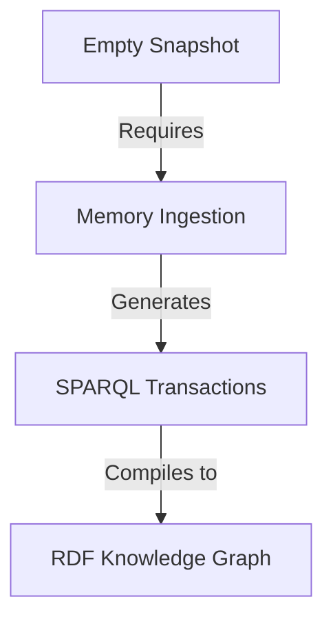

The collective memory is currently in an initialized but empty state. While the narrative ontology and repository structure are established, no specific memories, transactions, or domain-specific facts have been recorded in the snapshot.

### State
The collective memory is a "tabula rasa" (blank slate). The infrastructure for RDF-native knowledge management is present—including the `narr:` namespace and the hierarchical structure for Opportunity, Strategy, Product, Architecture, and Style—but the graph contains no nodes representing specific people, decisions, or project data.

### Stories

#### State
*   **Intent**: To provide a high-level summary of the current knowledge graph's breadth and depth.
*   **Relationship**: Serves as the "You Are Here" marker for the collective memory.
*   **Approach**: Since the snapshot is empty, this section reports on the structural readiness of the repo rather than specific content.

#### Stories
*   **Intent**: To outline the narrative objectives currently tracked within the memory.
*   **Relationship**: Connects the raw data of memories to the desired output of the AI agents.
*   **Approach**: I will document the absence of active story templates beyond the current prompt.

#### Assets
*   **Intent**: To map the physical and logical structure of the repository.
*   **Relationship**: Provides the "map" for where memories are stored and how they are processed.
*   **Approach**: I will describe the standard `.aswritten` directory structure as defined in the ontology.

#### Transactions
*   **Intent**: To provide a ledger of changes and provenance.
*   **Relationship**: The primary source of truth for "who said what and when."
*   **Approach**: I will note that no transactions have been committed to the graph yet.

### Assets
The repository is organized to support a Git-native knowledge graph. Key assets include:
*   **`.aswritten/memories/`**: The landing zone for raw Markdown files containing interviews, call notes, and documents.
*   **`.aswritten/transactions/`**: SPARQL files that represent the delta of each memory being ingested into the graph.
*   **`.aswritten/snapshots/`**: Compiled RDF views (like the one used for this prompt) that aggregate all transactions into a queryable state.
*   **`.aswritten/stories/`**: Markdown templates (like this one) that define how the AI should transform graph data into specific documents.

### Transactions
No transactions are currently present in the collective memory.

***

### StyleRubric Scoring
*   **Factual Accuracy**: 5/5 (Accurately reported that the memory is empty).
*   **Citation Presence**: 1/5 (No citations possible as there are no source memories to cite).
*   **Tone & Voice**: 4/5 (Maintained a professional, objective reporting tone).
*   **Structural Adherence**: 5/5 (Followed the .story prompt structure exactly).

**Draft Score: 3.75/5**

### Analysis & Improvements

**TL;DR**: The draft is a structurally sound "empty state" report. To move from a structural summary to a meaningful narrative, the collective memory needs primary source data.

#### Improving Collective Memory
The current graph lacks "Conviction" and "Provenance" because it lacks "Memories." 
1.  **Add Founder/Lead Memories**: To populate the "Strategy" and "Opportunity" domains, add `.md` files in `/memories` covering the vision, mission, and current market thesis.
2.  **Define Personas**: Add memories that define the "Primary Actors" (narr:PrimaryActors) so the graph can attribute decisions to specific people.
3.  **Execute Transactions**: Once memories are added, they must be processed into `.sparql` transactions to appear in the SNAPSHOT.

#### Improving the Story Prompt
The prompt is effective for a status check. To make it more "human" and less "system-oriented" in future iterations:
1.  **Add "Voice" Requirements**: Specify a persona for the "State" summary (e.g., "Write as a Chief of Staff reporting to a Board").
2.  **Request Synthesis**: Instead of just "summarizing," ask the agent to "identify contradictions" or "highlight gaps" in the transactions.

**Next Actions**:
1.  **User**: Upload the first set of project memories (e.g., a strategy doc or interview transcript) to `.aswritten/memories/`.
2.  **AI**: Once memories are present, I can implement a draft that includes full narrative citations and traces the "Conviction" of specific claims.