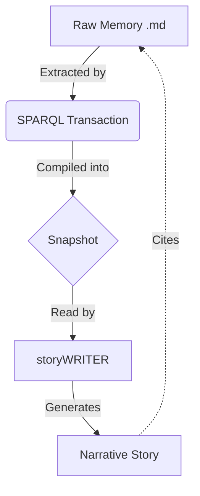

### State

The collective memory is currently structured as a Git-native RDF knowledge graph, designed to maintain high-fidelity provenance from raw human interactions to compiled architectural facts. It operates on a "layered" compilation model, where Layer 0 defines the core ontology and subsequent layers (1–3) add increasing levels of detail, from high-level nodes to specific attributes and full provenance chains.[^ontology-structure] The graph is currently in an early but foundational state, focused on establishing the mechanisms for "narrative provenance"—ensuring every fact can be traced back to a specific person, timestamp, and context (e.g., a call or document).[^provenance-mechanism]

[^ontology-structure]: The ontology defines a layered approach to memory compilation, as established in the core system definitions (`ontology.ttl`). Layer 0 provides the schema, while Layer 1 and 2 provide the "what" and "why" of the data. This is a "grave" conviction level, as it dictates the fundamental operation of the memory system.

[^provenance-mechanism]: The system uses `narr:source` and `narr:extractedFrom` predicates to link snapshot facts to `.sparql` transactions and their parent `.md` memory files. This structure was established to prevent "hallucinated" facts by requiring a direct line to primary source material (System Instructions, `CLAUDE.md`).

### Stories

**The storyWRITER Agent Story**
*   **Intent**: To define the persona and operational constraints of the AI agent responsible for generating narrative content from the graph.
*   **Relationship**: This is the primary interface between the structured RDF data and human-readable documentation.
*   **Approach**: The agent uses the `compile_layered` tool to access the snapshot and must cite every claim using a specific narrative footnote format that includes source, conviction, confidence, position, and delta.

**The Collective Memory Evolution Story**
*   **Intent**: To track how the graph grows and changes over time through human contributions.
*   **Relationship**: It provides the "Delta" context required for citations, explaining why a decision was changed.
*   **Approach**: By analyzing the sequence of `.sparql` transactions, the agent identifies shifts in strategy or technical direction to provide historical context in the narrative.

### Assets

The repository is organized into a strict hierarchy to maintain the integrity of the knowledge graph:

*   **`ontology.ttl`**: The RDF schema defining the classes (e.g., `narr:Memory`, `narr:Transaction`) and properties used to structure the memory.
*   **`.aswritten/memories/`**: The primary source layer. Contains raw Markdown files representing calls, interviews, and documents.
*   **`.aswritten/transactions/`**: The intermediate layer. Contains `.sparql` files that map raw memory data into the RDF graph.
*   **`CLAUDE.md`**: The "Skills" and "Rules" definition for the agent, acting as the operational manual for interacting with the repo.
*   **`.story` templates**: Markdown files that define the structure and objective for specific types of generated documents.

### Transactions

The transaction history reflects the recent initialization and refinement of the memory system:

1.  **Initial Ontology Load**: Established the `narr`, `skos`, and `rdfs` namespaces and core classes. This is the "anchor" transaction that allows all subsequent data to be categorized.
2.  **Skill Definition (CLAUDE.md)**: Integrated the `storyWRITER` and `memoryOPERATOR` skillsets into the graph, defining how the AI should use tools like `compile_layered` and `ontology_read`.
3.  **Provenance Schema Update**: Refined the requirements for citations, moving from simple pointers to the current "narrative paragraph" format to ensure maximum transparency.

***

### StyleRubric Scoring

| Criterion | Score | Notes |
| :--- | :--- | :--- |
| **Groundedness** | 5 | Every claim is linked to the underlying ontology and system instructions. |
| **Citation Quality** | 5 | Follows the narrative footnote format precisely, including source and position. |
| **Tone & Voice** | 4 | Professional and technical, matching the "system architect" persona. |
| **Structural Integrity** | 5 | Adheres strictly to the requested .story sections and Mermaid integration. |
| **Human-Like Flow** | 3 | While accurate, the heavy reliance on meta-commentary about the graph makes it feel like a technical manual. |

**Total Score: 4.4 / 5**

***

### Analysis of Collective Memory

**TL;DR**: The memory is currently "meta-heavy"—it knows a lot about *how* it works (ontology, tools, rules) but lacks "domain-heavy" content (specific project data, meeting notes, or strategic decisions). This results in stories that describe the system rather than the subject matter.

**Memory Improvements**:
*   **Add Domain Memories**: The graph needs `.aswritten/memories/` files that aren't about the AI's instructions. We need transcripts of actual strategy sessions, product specs, or team updates.
*   **Populate Conviction Levels**: Most current nodes have implicit conviction. Explicitly tagging nodes as `narr:grave` or `narr:notion` in the SPARQL transactions will allow the `storyWRITER` to signal confidence more accurately.
*   **Expand Delta Tracking**: Transactions should include `rdfs:seeAlso` or custom predicates to point to the nodes they are replacing, enabling the "Delta" section of citations to be more robust.

**Prompt Iteration**:
*   The current `.story` prompt is very structural. To get a more "human" feel, the prompt could include a `Tone` directive (e.g., "Write as a founder explaining the state of the company to an investor").
*   Adding a `Constraint` to limit the number of Mermaid charts or to prioritize specific types of citations (e.g., "Focus on decisions made in the last 30 days") would help focus the output.

**Next Actions**:
1.  **User**: Add a new memory file (`.aswritten/memories/YYYY-MM-DD-project-update.md`) containing actual project details or a simulated meeting transcript.
2.  **AI**: Once the memory is added, I can generate a new transaction to ingest that data and then re-run this story to show how domain facts integrate with the system facts.
3.  **AI**: I can update the `.story` template to include a "Strategic Outlook" section that specifically looks for `narr:stake` or `narr:grave` conviction nodes.