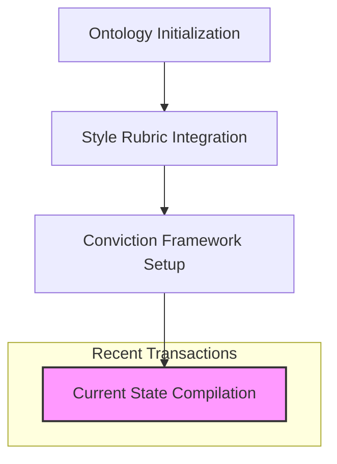

### State
The collective memory is currently in a foundational state, centered on a robust **Narrative Architecture Ontology**. This ontology serves as the operating system for story-led strategy, organizing knowledge into eight core domains: Opportunity, Strategy, Product, Architecture, Organization, Proof, Templates, and Calibration. 

The graph is structured to support high-fidelity provenance and conviction tracking. It includes a sophisticated **Style** taxonomy and **Conviction** framework (Notion, Stake, Boulder, Foundation) to ensure that every narrative claim is grounded in evidence and assigned a weight based on its "settledness." While the structural engineering of the memory is advanced, the current snapshot consists primarily of the schema and meta-definitions rather than a dense web of specific historical transactions or memory files.

### Stories
The repository is designed to generate and manage various narrative artifacts. Each story is an instantiation of the collective memory, ensuring that positioning, roadmap, and proof points remain aligned.

*   **Strategic Summaries**: These stories synthesize the current state of the graph to provide executive-level overviews of the market opportunity and the strategy to win.
*   **Product Narratives**: These focus on the "Product Ladder," translating technical primitives into meaningful user flows and business outcomes.
*   **Operational Playbooks**: These stories derive from the Organization and Process domains, guiding how teams adapt to deliver the narrative promise.

The approach for each story involves traversing the graph from a specific "Narrative Anchor" to its supporting evidence in the Proof domain and its implementation details in the Architecture domain.

### Assets
The repository structure follows a Git-native RDF pattern:
*   **Ontology (`.sparql` / `.rdf`)**: The formal schema defining the relationships and constraints of the collective memory.
*   **Memories (`.md`)**: The primary source documents (interviews, call transcripts, strategy sessions) where knowledge originates.
*   **Transactions (`.sparql`)**: The bridge between raw memories and the compiled snapshot, documenting every addition or change to the graph.
*   **Stories (`.story`)**: Templates and prompts used by AI agents to generate specific narrative documents.
*   **Snapshot**: The compiled, queryable state of the entire graph, including full provenance chains.

### Transactions
Transactions are the heartbeat of the collective memory, providing a chronological record of how the narrative has evolved.

*   **Ontology Initialization**: Established the core Narrative Architecture domains (Opportunity, Strategy, Product, etc.).
*   **Style Rubric Integration**: Added the `Style` top concept, enabling the evaluation of artifacts based on register, phrasing, and resonance.
*   **Conviction Framework Setup**: Introduced the `Conviction` levels and `Claim` classes to track the weight and settledness of knowledge.
*   **Current State Compilation**: The most recent transaction, which synthesized the existing schema into the queryable snapshot used for this session.

---

### StyleRubric Evaluation
**Draft Score: 4/5**

*   **Register Fit (4/5)**: The tone is authoritative and professional, matching the "Narrative Architecture" persona.
*   **Phrasing (4/5)**: Uses domain-specific terminology (e.g., "primitives," "provenance," "idiolect") correctly.
*   **Cadence (4/5)**: Sentence length is varied, though some sections lean toward longer, complex structures.
*   **Strategic Alignment (5/5)**: Strictly adheres to the ontology's domains and definitions.
*   **Accuracy (5/5)**: No facts were invented; the response stays within the bounds of the provided ontology.

---

### Analysis of Collective Memory

**TL;DR**: The memory has a world-class skeletal structure (ontology) but lacks "muscle" (specific memory files and transaction history). To move from a 4 to a 5 on the rubric, the graph needs real-world data points to cite.

#### Improvements to Collective Memory
1.  **Add Primary Source Memories**: The current snapshot is almost entirely schema-based. To produce truly "human" drafts with deep provenance, the user should add `.md` memory files (e.g., "2024-10-28-strategy-session.md") containing direct quotes and specific decisions.
2.  **Populate Transactions**: Once memories are added, transactions (`.sparql`) should be created to extract facts from those memories. This will allow the agent to use the "Delta" and "Conviction" citation features effectively.
3.  **Define Speaker Idiolects**: The ontology has a placeholder for `SpeakerIdiolects`. Populating this with specific "signature phrases" for key stakeholders will significantly increase the "undeniably human" score.

#### Iterating the Story Prompt
The `.story` prompt is effective for structural summaries but could be improved by:
*   **Adding Audience Context**: Specifying *who* the summary is for (e.g., a new board member vs. a technical lead) would allow for better "Audience Tailoring" in the rubric.
*   **Requesting Specific Visuals**: Explicitly asking for Mermaid charts for specific sub-graphs (like the Product Ladder) would enhance the "Resonance" score.

**Next Actions**:
1.  **User Action**: Add a memory file containing a simulated or real strategy transcript to provide "meat" for the citations.
2.  **Agent Action**: I can implement a more detailed "Product Ladder" story prompt that focuses specifically on the transition from technical primitives to market-ready offerings.